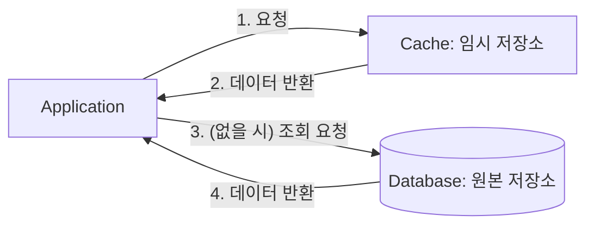
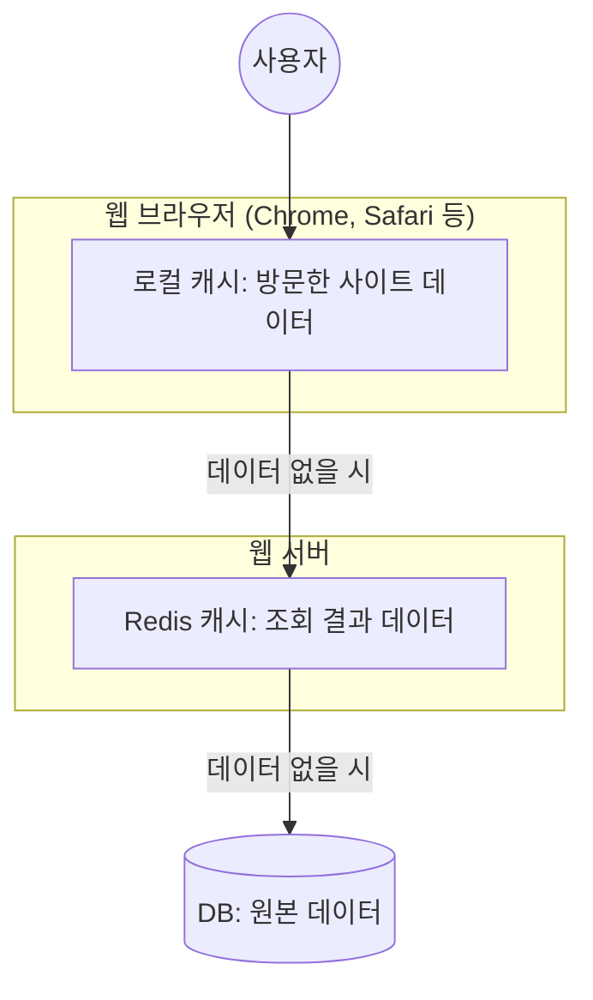

# 캐시(Cache), 캐싱(Caching)이란?

### ✅ 캐시(Cache)란?

**캐시(Cache)**란, **원본 저장소보다 빠르게 가져올 수 있는 임시 데이터 저장소**를 의미한다.

참고로 캐시(Cache)라는 단어는 Redis에서만 쓰이는 용어는 아니고 전반적인 개발 분야에서 통용되어 사용된다.

**[예시]**

### ✅ 캐싱(Caching)이란?

**캐싱(Caching)**이란 **캐시(Cache, 임시 데이터 저장소)에 접근해서 데이터를 빠르게 가져오는 방식**을 의미한다.

현업에서는 보통 다음과 같이 표현한다.

> “이 API는 응답 속도가 너무 느린데, 이 응답 데이터는 **캐싱(Caching)** 해두고 쓰는 게 어떨까?”

이 말은 **‘API 응답 결과를 원본 저장소보다 빠르게 가져올 수 있는 임시 데이터 저장소에 저장해두고, 빠르게 조회할 수 있게 만드는 것이 어떨까?’**라는 의미를 담고 있다.
