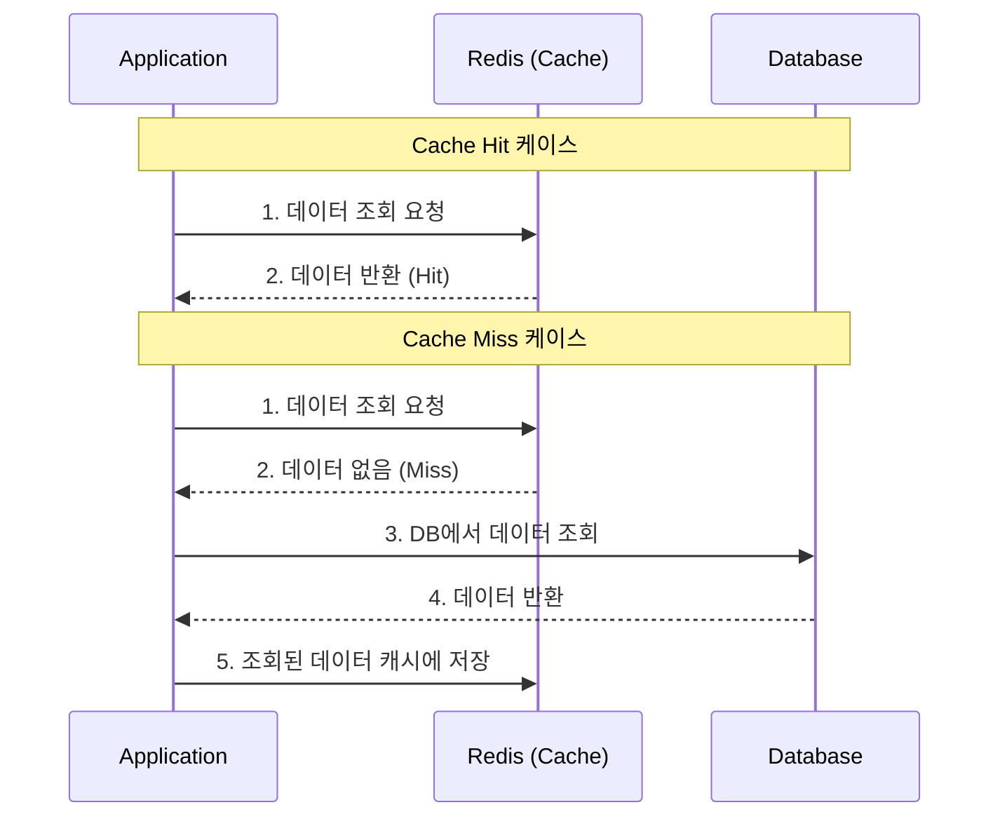
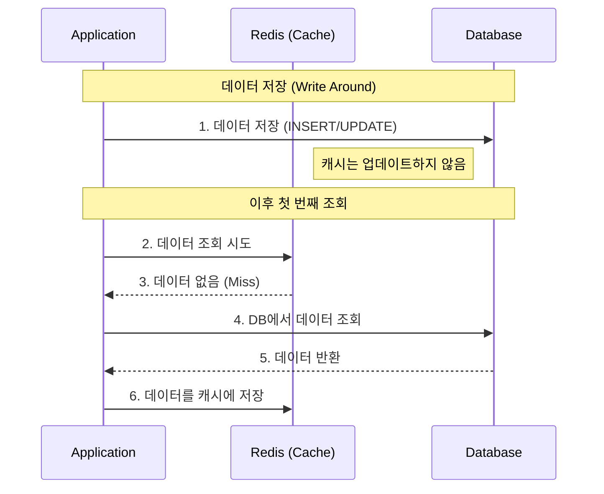
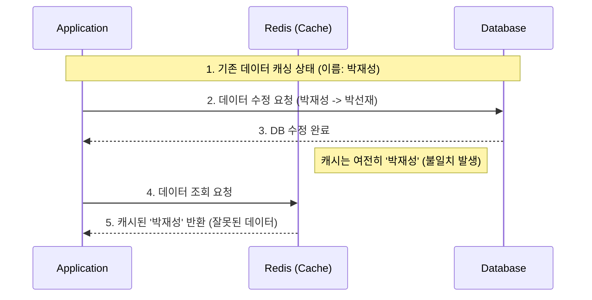
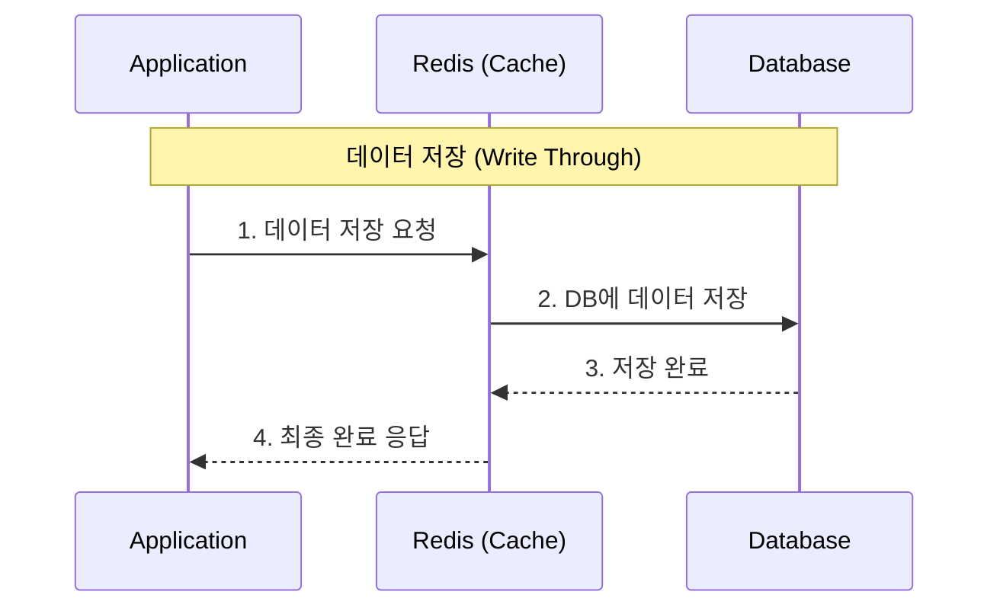
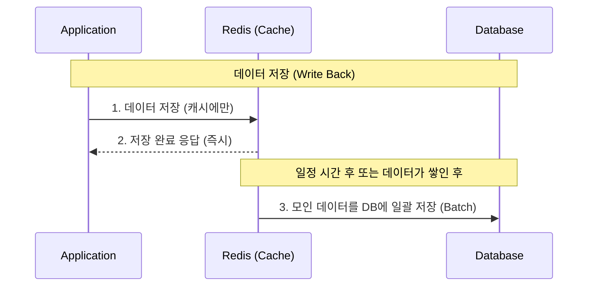

# 데이터를 캐싱할 때 사용하는 전략 (Cache Aside, Write Around, Write Through, Write Back)

레디스를 캐시로 사용할 때 어떤 방식으로 데이터를 처리할지에 대한 전략은 다양하다. 그중 현업에서 가장 많이 사용되는 **Cache Aside**, **Write Around**, **Write Through**, **Write Back** 전략에 대해 알아본다. 이 전략들을 제대로 이해하면 실무의 대부분의 케이스를 커버할 수 있다.

---

### ✅ Cache Aside (= Look Aside, Lazy Loading) 전략

데이터를 조회할 때 주로 사용하는 전략이다. **Look Aside** 또는 **Lazy Loading** 전략이라고도 부른다.

#### 1. 작동 방식
1. 애플리케이션은 데이터를 조회할 때 먼저 **캐시(Redis)**에 데이터가 있는지 확인한다.
2. **Cache Hit**: 캐시에 데이터가 있으면 캐시에서 바로 데이터를 가져온다.
3. **Cache Miss**: 캐시에 데이터가 없으면 **DB**에서 데이터를 조회한다.
4. DB에서 조회한 데이터를 애플리케이션에 전달하고, 동시에 **캐시에 저장**해둔다.

#### 2. 도식화 (Mermaid)

#### 3. 특징
- **장점**: 실제로 필요한 데이터만 캐시에 저장되므로 메모리를 효율적으로 사용할 수 있다. 또한, 캐시 서버에 장애가 발생해도 DB에서 데이터를 직접 가져올 수 있어 서비스가 중단되지 않는다.
- **단점**: 캐시에 데이터가 없는 초기에 요청이 몰릴 경우 DB에 부하가 집중될 수 있으며(Cache Warming이 필요한 이유), 데이터가 변경되었을 때 캐시와 DB 간의 데이터 불일치가 발생할 수 있다.

---

### ✅ Write Around 전략

데이터를 저장(쓰기, 수정, 삭제)할 때 사용하는 전략으로, Cache Aside와 함께 자주 조합되어 사용된다.

#### 1. 작동 방식
1. 데이터를 저장할 때 **DB**에만 직접 저장한다.
2. 캐시는 건드리지 않는다.
3. 이후 해당 데이터를 조회할 때 **Cache Miss**가 발생하면, 그때서야 DB에서 데이터를 읽어와 캐시에 저장한다.

#### 2. 도식화 (Mermaid)

#### 3. 특징
- **장점**: 쓰기 성능이 매우 빠르다. 캐시에 모든 데이터를 쓰지 않으므로 캐시 공간을 절약할 수 있다.
- **단점**: 데이터를 조회할 때 캐시에 데이터가 없으므로 첫 번째 조회 시에는 반드시 DB를 거쳐야 하며, 이때 지연 시간(Latency)이 발생한다.

---

### ⚠️ Cache Aside + Write Around 조합의 한계점

가장 대중적인 조합이지만, 다음과 같은 명확한 한계가 존재한다.

#### 1. 데이터 불일치 (Inconsistency)
- **문제**: 데이터를 수정할 때 DB만 업데이트하므로, 캐시에 남아있는 기존 데이터와 DB의 새로운 데이터가 서로 다를 수 있다.
- **예시**: 사용자가 이름을 '박재성'에서 '박선재'로 변경했지만, 캐시에 여전히 '박재성'이 남아있어 조회 시 옛날 이름이 표시됨.

#### 2. 제한된 자원 (Memory)
- **문제**: DB는 디스크(Disk)에 저장하여 대용량 처리가 가능하지만, 캐시는 메모리(RAM)를 사용하므로 저장 공간이 훨씬 작다. 모든 데이터를 무기한 캐싱할 수 없다.

#### 3. 도식화 (데이터 불일치 상황)

---

### 💡 해결 방법 및 전략 (TTL 활용)

기술에는 항상 **트레이드 오프(Trade-off)**가 존재한다. 완벽한 일치(Consistency)를 선택하면 성능을 포기해야 하고, 성능을 선택하면 일관성을 일부 양보해야 한다. Redis를 조회 성능 향상을 위해 사용한다면, 일관성을 조금 포기하더라도 다음과 같은 방법으로 한계를 극복한다.

#### 1. TTL (Time To Live) 설정
- **데이터 동기화**: Redis의 만료 시간(TTL) 기능을 활용한다. 일정 시간이 지나면 캐시 데이터가 자동으로 삭제되도록 설정한다.
- **갱신 효과**: 데이터가 삭제된 후 첫 조회 시 **Cache Miss**가 발생하며, 이때 DB에서 최신 데이터를 읽어와 캐시에 다시 저장(갱신)하게 된다.
- **공간 효율**: 자주 사용하지 않는 데이터는 만료되어 삭제되므로, 한정된 메모리 공간을 효율적으로 사용할 수 있다.

#### 2. 캐싱하기 적절한 데이터 선정
모든 데이터를 캐싱하기보다는 다음 조건에 맞는 데이터를 선정하는 것이 좋다.
- **자주 조회되는 데이터**
- **비교적 잘 변하지 않는 데이터** (수정 빈도가 낮은 데이터)
- **실시간으로 정확하게 일치하지 않아도 서비스에 지장이 없는 데이터**

---

### ✅ Write Through 전략

데이터를 저장할 때 DB와 캐시에 **동시에** 저장하는 전략이다.

#### 1. 작동 방식
1. 데이터를 저장할 때 먼저 **캐시**에 저장한다.
2. 캐시에 저장된 데이터를 즉시 **DB**에도 저장한다.
3. 데이터 저장 작업이 완료되면 애플리케이션에 응답한다.

#### 2. 도식화 (Mermaid)

#### 3. 특징
- **장점**: 캐시와 DB의 데이터가 항상 최신 상태로 유지(Consistency)되어 데이터 불일치 문제가 거의 없다. 조회 시 항상 최신 데이터를 캐시에서 바로 읽어올 수 있다.
- **단점**: 매번 두 곳에 데이터를 써야 하므로 쓰기 성능이 상대적으로 느리다. 자주 사용되지 않는 데이터까지 캐시에 저장되어 메모리 낭비가 발생할 수 있다.

---

### ✅ Write Back (= Write Behind) 전략

데이터를 캐시에 먼저 저장해두었다가, 일정 기간 또는 일정량이 쌓이면 **나중에 한꺼번에** DB에 반영하는 전략이다.

#### 1. 작동 방식
1. 데이터를 저장할 때 **캐시**에만 먼저 저장한다.
2. 애플리케이션은 DB 저장 여부와 상관없이 즉시 다음 작업을 수행한다.
3. 캐시에 모인 데이터를 배치(Batch) 작업을 통해 주기적으로 **DB**에 반영한다.

#### 2. 도식화 (Mermaid)

#### 3. 특징
- **장점**: 쓰기 성능이 매우 압도적으로 빠르다. 쓰기 작업이 많은 서비스(예: 로그 저장, 실시간 채팅 등)에서 DB 부하를 획기적으로 줄일 수 있다.
- **단점**: 캐시에 장애가 발생하여 데이터가 DB로 옮겨지기 전에 날아갈 경우, 데이터 유실의 위험이 있다.

---

### 💡 요약
- **Cache Aside**: 필요할 때만 캐시에 채우는 일반적인 **조회** 전략 (주로 TTL과 함께 사용)
- **Write Around**: DB에만 쓰고 조회 시 캐시를 채우는 **쓰기** 전략 (데이터 불일치 가능성 존재)
- **Write Through**: 캐시와 DB에 동시에 써서 데이터 일관성을 유지하는 전략
- **Write Back**: 캐시에 먼저 쓰고 나중에 DB에 모아서 쓰는 성능 중심 전략
