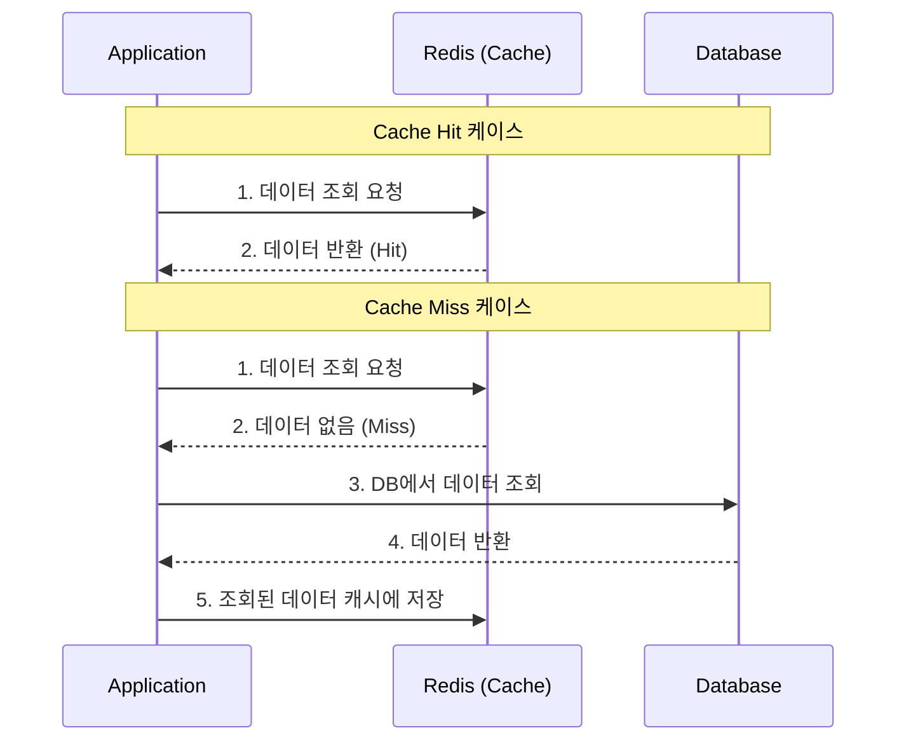
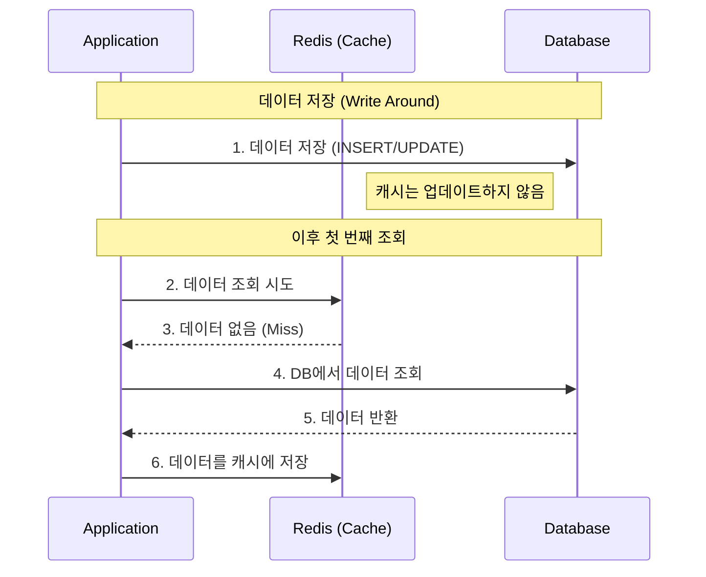

# 데이터를 캐싱할 때 사용하는 전략 (Cache Aside, Write Around)

레디스를 캐시로 사용할 때 어떤 방식으로 데이터를 처리할지에 대한 전략은 다양하다. 그중 현업에서 가장 많이 사용되는 **Cache Aside**와 **Write Around** 전략에 대해 알아본다. 이 두 가지 전략만 제대로 이해해도 실무의 많은 케이스를 커버할 수 있다.

---

### ✅ Cache Aside (= Look Aside, Lazy Loading) 전략

데이터를 조회할 때 주로 사용하는 전략이다. **Look Aside** 또는 **Lazy Loading** 전략이라고도 부른다.

#### 1. 작동 방식
1. 애플리케이션은 데이터를 조회할 때 먼저 **캐시(Redis)**에 데이터가 있는지 확인한다.
2. **Cache Hit**: 캐시에 데이터가 있으면 캐시에서 바로 데이터를 가져온다.
3. **Cache Miss**: 캐시에 데이터가 없으면 **DB**에서 데이터를 조회한다.
4. DB에서 조회한 데이터를 애플리케이션에 전달하고, 동시에 **캐시에 저장**해둔다.

#### 2. 도식화 (Mermaid)

#### 3. 특징
- **장점**: 실제로 필요한 데이터만 캐시에 저장되므로 메모리를 효율적으로 사용할 수 있다. 또한, 캐시 서버에 장애가 발생해도 DB에서 데이터를 직접 가져올 수 있어 서비스가 중단되지 않는다.
- **단점**: 캐시에 데이터가 없는 초기에 요청이 몰릴 경우 DB에 부하가 집중될 수 있으며(Cache Warming이 필요한 이유), 데이터가 변경되었을 때 캐시와 DB 간의 데이터 불일치가 발생할 수 있다.

---

### ✅ Write Around 전략

데이터를 저장(쓰기, 수정, 삭제)할 때 사용하는 전략으로, Cache Aside와 함께 자주 조합되어 사용된다.

#### 1. 작동 방식
1. 데이터를 저장할 때 **DB**에만 직접 저장한다.
2. 캐시는 건드리지 않는다.
3. 이후 해당 데이터를 조회할 때 **Cache Miss**가 발생하면, 그때서야 DB에서 데이터를 읽어와 캐시에 저장한다.

#### 2. 도식화 (Mermaid)

#### 3. 특징
- **장점**: 쓰기 성능이 매우 빠르다. 캐시에 모든 데이터를 쓰지 않으므로 캐시 공간을 절약할 수 있다.
- **단점**: 데이터를 조회할 때 캐시에 데이터가 없으므로 첫 번째 조회 시에는 반드시 DB를 거쳐야 하며, 이때 지연 시간(Latency)이 발생한다.

---

### 💡 한 줄 요약
- **Cache Aside**: 캐시에서 먼저 확인하고, 없으면 DB에서 가져와 캐시를 채우는 **조회** 전략이다.
- **Write Around**: 쓰기 작업은 DB에만 하고, 캐시는 조회 시점에 채우는 **쓰기** 전략이다.
