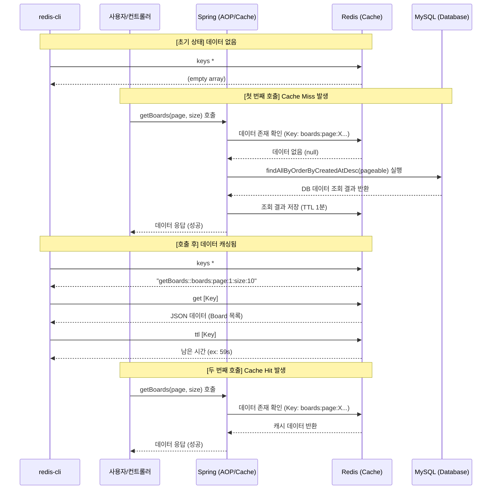

### Spring Boot 프로젝트에 Redis 셋팅 추가하기

#### 1. Redis 의존성 추가하기

**build.gradle**

```gradle
dependencies {
  // ...
  implementation 'org.springframework.boot:spring-boot-starter-data-redis'
}
```

의존성을 추가한 뒤 Gradle 프로젝트를 새로고침하여 반영합니다.

#### 2. application.yml 수정하기

**application.yml**

```yaml
spring:
  # ...
  data:
    redis:
      host: localhost
      port: 6379

logging:
  level:
    org.springframework.cache: trace # Redis 사용에 대한 로그가 조회되도록 설정
```

#### 3. Redis 설정 추가하기

**config/RedisConfig.java**

```java
@Configuration
public class RedisConfig {
  @Value("${spring.data.redis.host}")
  private String host;

  @Value("${spring.data.redis.port}")
  private int port;

  @Bean
  public LettuceConnectionFactory redisConnectionFactory() {
    return new LettuceConnectionFactory(new RedisStandaloneConfiguration(host, port));
  }
}
```

**config/RedisCacheConfig.java**

```java
@Configuration
@EnableCaching // Spring Boot의 캐싱 설정을 활성화
public class RedisCacheConfig {
  @Bean
  public CacheManager boardCacheManager(RedisConnectionFactory redisConnectionFactory) {
    RedisCacheConfiguration redisCacheConfiguration = RedisCacheConfiguration
        .defaultCacheConfig()
        .serializeKeysWith(
            RedisSerializationContext.SerializationPair.fromSerializer(
                new StringRedisSerializer()))
        .serializeValuesWith(
            RedisSerializationContext.SerializationPair.fromSerializer(
                new Jackson2JsonRedisSerializer<Object>(Object.class)
            )
        )
        .entryTtl(Duration.ofMinutes(1L));

    return RedisCacheManager
        .RedisCacheManagerBuilder
        .fromConnectionFactory(redisConnectionFactory)
        .cacheDefaults(redisCacheConfiguration)
        .build();
  }
}
```

#### 4. BoardService에 캐싱 로직 추가하기

**BoardService.java**

```java
@Service
public class BoardService {
  // ...
  /**
   * @Cacheable 어노테이션을 붙이면 Cache Aside 전략으로 캐싱이 적용됩니다.
   * 즉, 해당 메서드로 요청이 들어오면 레디스를 확인한 후에 데이터가 있다면 레디스의 데이터를 조회해서 바로 응답합니다.
   * 만약 데이터가 없다면 메서드 내부의 로직을 실행시킨 뒤에 return 값으로 응답합니다.
   * 그리고 그 return 값을 레디스에 저장합니다.
   * 
   * [속성 값 설명]
   * - cacheNames : 캐시 이름을 설정
   * - key : Redis에 저장할 Key의 이름을 설정 (SpEL 표현식 사용)
   * - cacheManager : 사용할 cacheManager의 Bean 이름을 지정
   */
  @Cacheable(cacheNames = "getBoards", key = "'boards:page:' + #page + ':size:' + #size", cacheManager = "boardCacheManager")
  public List<Board> getBoards(int page, int size) {
    Pageable pageable = PageRequest.of(page - 1, size);
    Page<Board> pageOfBoards = boardRepository.findAllByOrderByCreatedAtDesc(pageable);
    return pageOfBoards.getContent();
  }
}
```

#### 5. BoardService 작동 흐름 및 도식화 (Cache Aside 전략)

`BoardService`의 `getBoards` 메서드에 적용된 `@Cacheable`은 **Cache Aside (Look-Aside)** 전략으로 동작합니다. 이 전략의 핵심은 **"애플리케이션이 캐시를 먼저 확인하고, 없으면 DB에서 가져온다"**는 것입니다.

**상세 흐름:**
1.  **캐시 확인 (Cache Hit Check)**: 
    *   사용자가 `getBoards(page, size)`를 호출하면, Spring은 설정된 키(`getBoards::boards:page:1:size:10`)가 Redis에 존재하는지 먼저 확인합니다.
2.  **캐시 히트 (Cache Hit)**:
    *   Redis에 해당 키의 데이터가 있다면, **메서드 내부 로직(DB 조회)을 실행하지 않고** Redis의 데이터를 즉시 반환합니다.
3.  **캐시 미스 (Cache Miss)**:
    *   Redis에 데이터가 없다면, **메서드 내부 로직을 실행**하여 DB에서 데이터를 조회합니다.
4.  **캐시 갱신 (Cache Write)**:
    *   DB에서 조회된 결과 데이터를 **Redis에 저장**하고(설정된 1분 TTL 적용), 사용자에게 반환합니다.

**작동 흐름 및 상태 확인 도식 (Sequence Diagram):**



**요약 흐름도 (Flowchart):**
1. **[시작]** -> 요청 발생
2. **[Redis 확인]** 
   - 데이터 있음? -> **[Yes]** -> Redis 데이터 반환 -> **[종료]**
   - 데이터 없음? -> **[No]** -> **[DB 조회]** -> **[Redis에 저장]** -> 데이터 반환 -> **[종료]**

#### 6. Docker를 통한 Redis 실행 설정

**docker-compose.yml**

Redis 서비스를 추가하고, 애플리케이션 서비스에서 Redis를 참조하도록 설정합니다.

```yaml
services:
  app:
    # ...
    environment:
      - SPRING_DATA_REDIS_HOST=redis
      - SPRING_DATA_REDIS_PORT=6379
    depends_on:
      - mysql
      - redis

  redis:
    image: redis:alpine
    container_name: redis-container
    ports:
      - "6379:6379"
    restart: always
```

#### 7. 테스트 및 확인

1. **로그 확인**: 캐시가 없을 때 DB 조회가 발생하고, 이후 동일 요청 시 캐시에서 데이터를 가져오는지 로그(`org.springframework.cache: trace`)를 통해 확인합니다.
2. **Redis-cli 확인**:
   ```bash
   $ redis-cli
   $ keys * # 모든 키 조회
   $ get getBoards::boards:page:1:size:10 # 특정 키 값 조회
   $ ttl getBoards::boards:page:1:size:10 # TTL 확인
   ```
