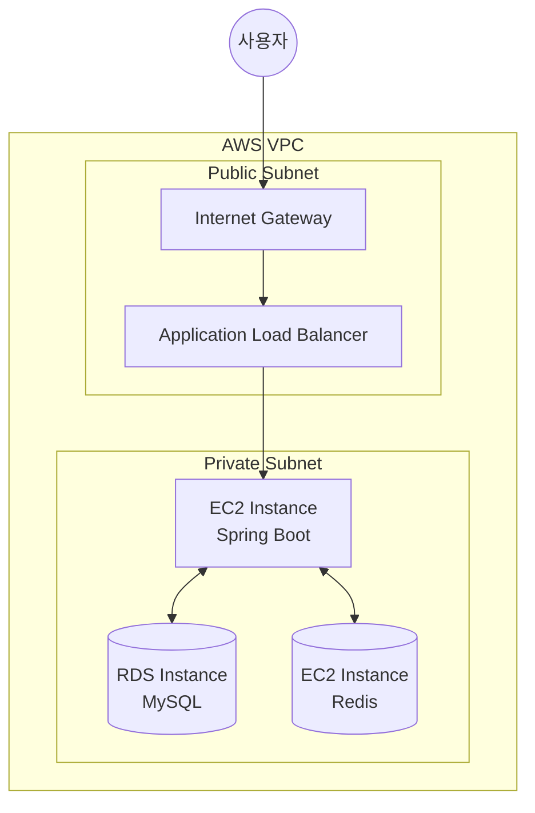

# AWS 환경에서의 Redis 아키텍처 구성

AWS 클라우드 환경에서 EC2, RDS, Redis를 활용하여 확장 가능하고 성능이 최적화된 아키텍처를 구성하는 방법입니다.

### ✅ 아키텍처 구성도

AWS의 VPC(Virtual Private Cloud) 내에 애플리케이션 서버(EC2)와 데이터베이스(RDS), 캐시 서버(Redis)를 배치하는 전형적인 3-Tier 아키텍처입니다.

### ✅ 구성 요소별 역할

| 구성 요소 | 역할 | 상세 설명 |
| :--- | :--- | :--- |
| **EC2 Instance** | 애플리케이션 서버 | Spring Boot 애플리케이션이 구동되는 서버입니다. 유연한 확장을 위해 Auto Scaling 그룹으로 관리될 수 있습니다. |
| **RDS (MySQL)** | 관계형 데이터베이스 | 영구적인 데이터를 저장하는 메인 데이터베이스입니다. 고가용성을 위해 Multi-AZ 구성을 권장합니다. |
| **Redis (EC2)** | 캐시 서버 | DB의 부하를 줄이고 응답 속도를 높이기 위해 자주 조회되는 데이터를 메모리에 보관합니다. (추후 ElastiCache로 대체 가능) |
| **VPC & Subnet** | 네트워크 환경 | 보안을 위해 애플리케이션과 DB 서버를 Private Subnet에 배치하고, 외부와의 통신은 NAT Gateway나 ALB를 통해 수행합니다. |

### ✅ 데이터 흐름 (Cache Aside)

1. **사용자 요청**: 사용자가 API를 호출합니다.
2. **캐시 확인**: EC2(Spring Boot)는 먼저 Redis 서버에 데이터가 있는지 확인합니다.
3. **Cache Hit**: 데이터가 있으면 즉시 사용자에게 반환합니다.
4. **Cache Miss**: 데이터가 없으면 RDS(MySQL)에서 데이터를 조회합니다.
5. **캐시 저장**: RDS에서 조회한 데이터를 Redis에 저장하고 사용자에게 반환합니다.

### ✅ 보안 그룹(Security Group) 설정

보안을 위해 각 구성 요소 간의 포트 허용 설정이 중요합니다.

- **EC2 Security Group**: 8080 포트 허용 (from ALB)
- **RDS Security Group**: 3306 포트 허용 (from EC2 Security Group)
- **Redis Security Group**: 6379 포트 허용 (from EC2 Security Group)
